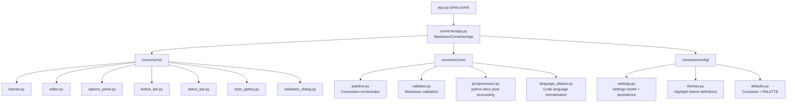
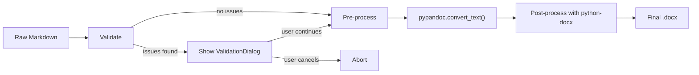
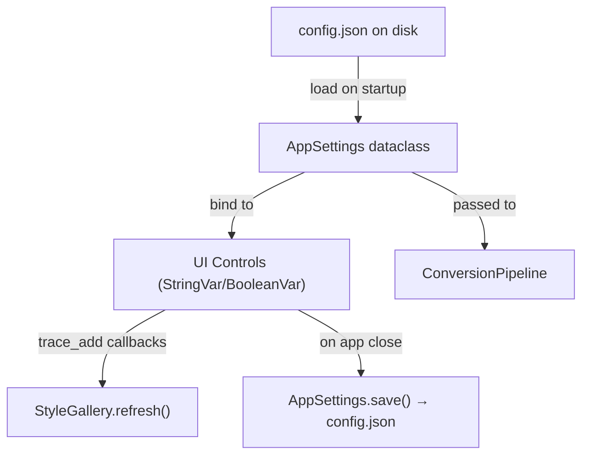
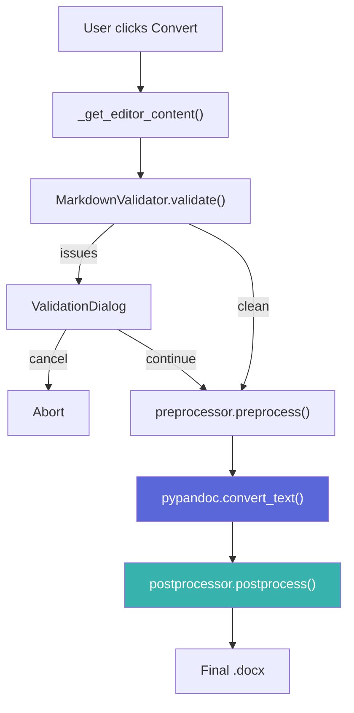

# Enhanced Markdown-to-DOCX Converter — Implementation Plan

## Background

The current application is a single-file ([app.py](file:///c:/Users/Acer/Desktop/Project/Markdown_Converter/app.py)) tkinter GUI that converts Markdown to Word documents via `pypandoc`. It has ~750 lines, a dark theme, clipboard import, highlight style selection, and threaded conversion. All logic lives in a single `MarkdownConverterApp` class inheriting from `tk.Tk`.

This plan extends the existing architecture into a modular package structure while preserving the current application skeleton, UI patterns, and Pandoc-based conversion pipeline.

---

## User Review Required

> [!IMPORTANT]
> **Window Size**: The current window is `720×580`. The new features (expanded options panel, style gallery) will require expanding this. The plan proposes `960×720` as the new default with `800×600` minimum. Please confirm this is acceptable.

> [!IMPORTANT]
> **New Dependencies**: This plan adds **zero new pip dependencies**. All features use Pandoc flags, `python-docx` (already listed in the stack), and stdlib modules. The only net-new library needed is `python-docx` for post-processing (tables, task lists, code styling), which is already in the project's tech stack per the overview doc. Please confirm `python-docx` is installed or if it should be added to a requirements file.

> [!WARNING]
> **Breaking Change — Module Restructure**: The current flat `app.py` will be refactored into a package (`converter/`). The entry point (`app.py` at root) will remain for backward compatibility, but it will delegate to the package. The PyInstaller `.spec` file will need a minor path update.

---

## Open Questions

> [!IMPORTANT]
> **Q1 — Configuration Persistence**: Should user preferences (theme, font, code style, etc.) persist across sessions? The plan proposes a `config.json` file in the application directory. Alternatively, preferences could be stored in `%APPDATA%`. Which approach do you prefer?

> [!IMPORTANT]
> **Q2 — Alternating Row Shading**: For table row shading, should this be on by default, or should it be a user toggle in the options panel?

> [!NOTE]
> **Q3 — Broken Hyperlink Detection**: The plan marks this as optional/best-effort since it requires network requests (HTTP HEAD checks). Should this be included in the initial implementation or deferred?

---

## 1. Overall Architecture

### Current Architecture (Monolithic)
```
app.py (751 lines — everything in one file)
├── PALETTE / constants
├── MarkdownConverterApp(tk.Tk)
│   ├── _build_ui() → banner, editor, options, buttons, status
│   ├── _run_conversion() → pypandoc.convert_text()
│   └── callbacks / helpers
└── _lighten() utility
```

### Proposed Architecture (Modular Package)


**Key Principle**: The `MarkdownConverterApp` class remains the application shell. Each `_build_*` method is extracted into its own UI module that receives a parent frame and a reference to the shared settings/state. The conversion pipeline becomes a composable chain: **Validate → Pre-process → Pandoc Convert → Post-process**.

---

## 2. Proposed Folder & File Structure

```
Markdown_Converter/
├── app.py                          ← [MODIFY] Thin launcher (imports & runs converter.app)
├── MarkdownToWord.spec             ← [MODIFY] Update paths for package structure
├── config.json                     ← [NEW] User preferences (auto-created on first run)
│
├── converter/                      ← [NEW] Main application package
│   ├── __init__.py
│   ├── app.py                      ← [NEW] MarkdownConverterApp class (extracted from root app.py)
│   │
│   ├── ui/                         ← [NEW] UI component modules
│   │   ├── __init__.py
│   │   ├── banner.py               ← Banner/header widget
│   │   ├── editor.py               ← ScrolledText editor with placeholder logic
│   │   ├── options_panel.py         ← Expanded options (highlight, font, code style, etc.)
│   │   ├── button_bar.py           ← Action buttons (clipboard, clear, convert)
│   │   ├── status_bar.py           ← Status bar with message levels
│   │   ├── style_gallery.py        ← Sample preview gallery (heading, paragraph, table, code)
│   │   └── validation_dialog.py    ← Warning dialog for validation issues
│   │
│   ├── core/                       ← [NEW] Conversion engine modules
│   │   ├── __init__.py
│   │   ├── pipeline.py             ← Orchestrates validate → convert → post-process
│   │   ├── validator.py            ← Markdown validation checks
│   │   ├── preprocessor.py         ← Markdown pre-processing (task lists, smart typography)
│   │   ├── postprocessor.py        ← python-docx post-processing (tables, code blocks, etc.)
│   │   └── language_aliases.py     ← Language name normalization map
│   │
│   └── config/                     ← [NEW] Configuration & theming
│       ├── __init__.py
│       ├── defaults.py             ← PALETTE, constants, default settings
│       ├── settings.py             ← Settings dataclass + JSON load/save
│       └── themes.py               ← Highlight theme metadata & code font registry
│
├── APP_OVERVIEW.md
├── README.md
└── (existing build/, dist/, etc.)
```

### Total New Files: 18
### Modified Files: 2 (`app.py`, `MarkdownToWord.spec`)

---

## 3. New Modules & Classes — Detailed Design

---

### 3.1 `converter/config/defaults.py`

**Purpose**: Centralize all constants currently scattered in the top of `app.py`.

| Export | Type | Description |
|--------|------|-------------|
| `PALETTE` | `dict` | Color palette (moved from `app.py` lines 49–70) |
| `BANNER_TOP` / `BANNER_BOTTOM` | `str` | Banner gradient colors |
| `DEFAULT_HIGHLIGHT_STYLE` | `str` | `"tango"` |
| `DEFAULT_CODE_FONT` | `str` | `"Consolas"` |
| `DEFAULT_CODE_FONT_SIZE` | `int` | `10` |
| `AVAILABLE_HIGHLIGHT_STYLES` | `list[str]` | All Pandoc themes + `"github"` |
| `AVAILABLE_CODE_FONTS` | `list[str]` | `["Consolas", "Cascadia Code", "Fira Code", "JetBrains Mono", "Courier New"]` |
| `LANGUAGE_ALIAS_MAP` | `dict[str, str]` | Canonical alias mapping |

---

### 3.2 `converter/config/settings.py`

**Purpose**: A `dataclass` representing all user-configurable settings, with JSON serialization.

```
@dataclass
class AppSettings:
    # Code highlighting
    highlight_style: str = "tango"
    code_font: str = "Consolas"
    code_font_size: int = 10
    code_bg_color: str = "#F5F5F5"
    code_line_spacing: float = 1.15
    code_border_visible: bool = True
    code_line_numbers: bool = False
    code_line_wrap: bool = True
    
    # Smart typography
    smart_typography: bool = True
    
    # Table options
    table_autofit: bool = True
    table_header_repeat: bool = True
    table_alternating_shading: bool = False
    
    # Output
    output_prefix: str = "llm_output"
    
    # Validation
    validate_before_convert: bool = True
    check_broken_links: bool = False

    def save(path: str) → None
    @classmethod
    def load(path: str) → AppSettings
```

**Persistence**: Reads/writes `config.json` using stdlib `json`. Falls back to defaults if file is missing or corrupt.

---

### 3.3 `converter/config/themes.py`

**Purpose**: Theme metadata beyond just the Pandoc style name — maps each theme to representative colors for the Style Gallery previews.

| Theme | Keyword Color | String Color | Comment Color | Background |
|-------|--------------|-------------|---------------|------------|
| `tango` | `#204A87` | `#4E9A06` | `#8F5902` | `#F8F8F8` |
| `github` | `#D73A49` | `#032F62` | `#6A737D` | `#F6F8FA` |
| `zenburn` | `#F0DFAF` | `#CC9393` | `#7F9F7F` | `#3F3F3F` |
| ... | ... | ... | ... | ... |

This allows the Style Gallery to render approximate syntax-highlighted code samples **without** invoking Pandoc, enabling instant visual feedback.

**Font Fallback Strategy**: A utility function `resolve_code_font(preferred: str) → str` that checks if the requested font family is available on the system via `tkinter.font.families()`. Falls back through the list `[preferred, "Consolas", "Courier New", "monospace"]`.

---

### 3.4 `converter/core/language_aliases.py`

**Purpose**: Normalize code fence language identifiers before passing to Pandoc.

**Design**:
```
ALIAS_MAP: dict[str, str] = {
    "py": "python",
    "python3": "python",
    "js": "javascript",
    "ts": "typescript",
    "sh": "bash",
    "shell": "bash",
    "c++": "cpp",
    "ps1": "powershell",
    # ... extensible
}

def normalize_language(lang: str) → str:
    """Return canonical language name, or the original if not aliased."""
    return ALIAS_MAP.get(lang.lower().strip(), lang.lower().strip())

def normalize_code_fences(markdown: str) → tuple[str, list[str]]:
    """
    Scan markdown for ```lang blocks, normalize aliases, 
    return (modified_markdown, list_of_unknown_languages).
    """
```

**Unknown language handling**: If a language is not in Pandoc's supported list and not an alias, it is left as-is (Pandoc will format it as a plain code block without highlighting). The unknown languages are returned so the UI can optionally warn the user.

**Extensibility**: The `ALIAS_MAP` is a simple dictionary. Users could extend it via a `custom_aliases` field in `config.json` that gets merged at startup.

---

### 3.5 `converter/core/validator.py`

**Purpose**: Pre-conversion Markdown validation that catches common issues.

**Design**:
```
@dataclass
class ValidationIssue:
    severity: Literal["error", "warning", "info"]
    line: int | None
    message: str
    suggestion: str | None = None

class MarkdownValidator:
    def validate(self, markdown: str) → list[ValidationIssue]
```

**Validation Checks**:

| Check | Severity | Strategy |
|-------|----------|----------|
| Unclosed fenced code blocks | Error | Count ` ``` ` markers; odd count = unclosed |
| Invalid table formatting | Warning | Check pipe table rows have consistent column count |
| Incorrect list indentation | Warning | Detect mixing of tabs/spaces; flag 1-space or 3-space indents |
| Missing image files | Warning | Extract `` references; check local paths with `os.path.exists()` |
| Broken hyperlinks | Info (opt.) | Extract `[](url)` with `http(s)://`; optionally HEAD-request (timeout 3s) |

**Integration**: The validator runs synchronously on the main thread before spawning the conversion thread (Markdown validation is fast — sub-millisecond for typical documents). If issues are found, a `ValidationDialog` is shown.

---

### 3.6 `converter/core/preprocessor.py`

**Purpose**: Transform the raw Markdown before handing it to Pandoc.

**Responsibilities**:

1. **Language alias normalization** — calls `normalize_code_fences()` to fix fence labels.
2. **Task list preparation** — Pandoc's `markdown` format doesn't natively handle GFM task lists (`- [x]`). Two strategies:
   - **Preferred**: Use `format="gfm"` or `format="markdown+task_lists"` as the input format, which Pandoc 2.6+ supports natively.
   - **Fallback**: If the Pandoc version is old, regex-replace `- [x]` / `- [ ]` with Unicode checkbox symbols (`☑` / `☐`).
3. **Smart typography** — Pandoc already handles this via `+smart` extension (enabled by default with `format="markdown"`). Ensure the format string includes `+smart` explicitly.

**Design Decision**: The preprocessor is a pure function `preprocess(markdown: str, settings: AppSettings) → str` — no side effects, easily testable.

---

### 3.7 `converter/core/postprocessor.py`

**Purpose**: After Pandoc generates the `.docx`, open it with `python-docx` and apply enhancements that Pandoc cannot do natively.

**This is the most complex new module.** Responsibilities:

#### Table Post-Processing
```
class TablePostProcessor:
    def process(self, doc: Document, settings: AppSettings) → None
```

| Enhancement | Implementation |
|------------|---------------|
| Auto-fit table width | Set `table.autofit = True`; set table width to `Inches(6.5)` (full page) |
| Preserve column alignment | Read alignment from Pandoc output; apply paragraph alignment per cell |
| Repeat header row | Set `row.repeat_header_row = True` on first row of each table (via `python-docx` XML manipulation: `<w:tblHeader/>`) |
| Improved borders | Apply consistent `Pt(0.5)` single-line borders via `OxmlElement` manipulation |
| Alternating row shading | Apply light gray (`#F2F2F2`) background to even-indexed data rows via `<w:shd>` XML |

#### Task List Post-Processing
```
class TaskListPostProcessor:
    def process(self, doc: Document) → None
```
- Scan paragraphs for Unicode checkbox markers (`☑`/`☐`) inserted by the preprocessor.
- Replace with:
  - **Option A (Recommended)**: Wingdings checkbox characters (`☐` = Wingdings char 168, `☑` = Wingdings char 254) — universally available on Windows.
  - **Option B**: Keep Unicode symbols but apply a specific font that renders them well.

#### Code Block Post-Processing
```
class CodeBlockPostProcessor:
    def process(self, doc: Document, settings: AppSettings) → None
```

| Enhancement | Implementation |
|------------|---------------|
| Custom font family | Find paragraphs with "Source Code" style; override `run.font.name` |
| Font size | Override `run.font.size` to `Pt(settings.code_font_size)` |
| Background color | Apply paragraph shading via `<w:shd>` XML element |
| Line spacing | Set `paragraph.paragraph_format.line_spacing` |
| Border visibility | Add/remove `<w:pBdr>` elements |
| Line numbers | Prepend line number runs to each code paragraph (requires splitting by newline) |
| Line wrapping | **Cannot be enforced in DOCX** — Word always wraps. Instead, ensure code paragraphs don't use `"keep with next"` excessively, and set reasonable page margins. |
| Keep together | Apply `paragraph_format.keep_together = True` for code blocks ≤ 30 lines; for longer blocks, allow page breaks |

#### Orchestration
```
def postprocess(doc_path: str, settings: AppSettings) → None:
    doc = Document(doc_path)
    TablePostProcessor().process(doc, settings)
    TaskListPostProcessor().process(doc)
    CodeBlockPostProcessor().process(doc, settings)
    doc.save(doc_path)
```

---

### 3.8 `converter/core/pipeline.py`

**Purpose**: Orchestrate the full conversion pipeline. Replaces the current `_run_conversion()` method body.



```
class ConversionPipeline:
    def __init__(self, settings: AppSettings)
    
    def validate(self, markdown: str) → list[ValidationIssue]
    def convert(self, markdown: str, output_path: str, 
                progress_callback: Callable) → ConversionResult

@dataclass
class ConversionResult:
    success: bool
    output_path: str | None
    warnings: list[str]
    unknown_languages: list[str]
    error_message: str | None
```

**Pandoc Format String**: The pipeline constructs the Pandoc input format string dynamically:
```
format = "markdown+pipe_tables+task_lists+strikeout+footnotes+smart+tex_math_dollars"
```
This single format string enables all required GFM features.

**Math Equations**: Pandoc natively converts `$inline$` and `$$block$$` LaTeX math into OMML (Office Math Markup Language) when targeting DOCX. No post-processing needed — just ensure `+tex_math_dollars` is in the format string.

**Footnotes**: Similarly, `+footnotes` in the format string enables Pandoc's native footnote support, which maps directly to Word's built-in footnote system.

---

## 4. UI Changes

### 4.1 Modified Window Layout

The current layout has 5 rows: `banner → editor → options → buttons → status`. The new layout expands the options row into a multi-section panel and adds the Style Gallery.

```
┌─────────────────────────────────────────────────────┐
│  Banner (unchanged)                                  │
├─────────────────────────────────────────────────────┤
│                                                      │
│  Markdown Editor (unchanged, takes remaining space)  │
│                                                      │
├─────────────────────────────────────────────────────┤
│  Options Panel (expanded — tabbed or sectioned)      │
│  ┌──────────┬───────────┬──────────────┐            │
│  │ General  │ Code Style│ Tables       │            │
│  └──────────┴───────────┴──────────────┘            │
├─────────────────────────────────────────────────────┤
│  Style Gallery  (4 mini-previews side by side)       │
├─────────────────────────────────────────────────────┤
│  Button Bar (unchanged)                              │
├─────────────────────────────────────────────────────┤
│  Status Bar (unchanged)                              │
└─────────────────────────────────────────────────────┘
```

### 4.2 `converter/ui/options_panel.py` — Expanded Options

Replace the current single-row options with a collapsible/tabbed panel using `ttk.Notebook` (already available in tkinter).

**Tab 1: General**
| Control | Widget | Variable |
|---------|--------|----------|
| Output file prefix | `Entry` | `settings.output_prefix` |
| Smart typography | `Checkbutton` | `settings.smart_typography` |
| Validate before convert | `Checkbutton` | `settings.validate_before_convert` |

**Tab 2: Code Style**
| Control | Widget | Variable |
|---------|--------|----------|
| Highlight theme | `Combobox` | `settings.highlight_style` |
| Code font | `Combobox` | `settings.code_font` |
| Font size | `Spinbox` | `settings.code_font_size` |
| Background style | `Combobox` | Light / Dark / None |
| Line spacing | `Spinbox` | `settings.code_line_spacing` |
| Show borders | `Checkbutton` | `settings.code_border_visible` |
| Show line numbers | `Checkbutton` | `settings.code_line_numbers` |

**Tab 3: Tables**
| Control | Widget | Variable |
|---------|--------|----------|
| Auto-fit width | `Checkbutton` | `settings.table_autofit` |
| Repeat header row | `Checkbutton` | `settings.table_header_repeat` |
| Alternating row shading | `Checkbutton` | `settings.table_alternating_shading` |

Every control is bound via `trace_add("write", ...)` on its `StringVar`/`BooleanVar` so that changes instantly trigger the Style Gallery refresh.

### 4.3 `converter/ui/style_gallery.py` — Sample Preview Gallery

**Architecture**: A horizontal `Frame` containing 4 `Canvas` widgets, each rendering a miniature sample.

```
class StyleGallery(tk.Frame):
    def __init__(self, parent, settings: AppSettings)
    def refresh(self) → None  # Called when any setting changes
    
    def _render_heading_sample(self, canvas: tk.Canvas)
    def _render_paragraph_sample(self, canvas: tk.Canvas)
    def _render_table_sample(self, canvas: tk.Canvas)
    def _render_code_sample(self, canvas: tk.Canvas)
```

**Rendering Strategy**: Each sample is drawn directly onto a `tkinter.Canvas` using `create_text()`, `create_rectangle()`, and `create_line()`. This requires **no external dependencies** and renders instantly.

| Sample | What It Shows |
|--------|--------------|
| **Heading** | "Sample Heading" in a bold serif font, sized proportionally to simulate Word heading styles |
| **Paragraph** | 2–3 lines of lorem ipsum in a regular font, demonstrating body text appearance |
| **Table** | A 3×3 mini-table drawn with lines, showing header styling, borders, and optional shading |
| **Code Block** | 3–4 lines of sample code (`def hello():` etc.) using the selected code font, theme colors from `themes.py`, with optional line numbers and border |

**Dimensions**: Each canvas is approximately `200×120` pixels. The gallery strip is ~`820×140` total.

**Performance**: All rendering is canvas draw calls — no file I/O, no subprocess, no Pandoc. Refresh is < 5ms.

### 4.4 `converter/ui/validation_dialog.py`

A modal `Toplevel` window that displays validation issues in a scrollable list.

```
class ValidationDialog(tk.Toplevel):
    def __init__(self, parent, issues: list[ValidationIssue])
    def result(self) → Literal["continue", "cancel"]
```

Each issue is displayed with:
- An icon (🔴 error, 🟡 warning, 🔵 info)
- Line number (if available)
- Message text
- Suggested fix (if available)

Two buttons: **"Convert Anyway"** and **"Cancel"**.

---

## 5. Data Flow

### Configuration Data Flow


### Conversion Data Flow


The pipeline runs in the existing `threading.Thread` pattern. The only change: `_run_conversion()` now calls `ConversionPipeline.convert()` instead of directly calling `pypandoc`.

---

## 6. Configuration Management

### File Format: `config.json`
```json
{
  "highlight_style": "tango",
  "code_font": "Consolas",
  "code_font_size": 10,
  "code_bg_color": "#F5F5F5",
  "code_line_spacing": 1.15,
  "code_border_visible": true,
  "code_line_numbers": false,
  "code_line_wrap": true,
  "smart_typography": true,
  "table_autofit": true,
  "table_header_repeat": true,
  "table_alternating_shading": false,
  "output_prefix": "llm_output",
  "validate_before_convert": true,
  "check_broken_links": false
}
```

### Lifecycle
1. **Startup**: `AppSettings.load("config.json")` — returns defaults if file missing.
2. **Runtime**: UI controls are two-way bound to the settings object via `StringVar.trace_add()`.
3. **Shutdown**: `app.protocol("WM_DELETE_WINDOW", ...)` triggers `AppSettings.save()`.
4. **Corruption resilience**: If JSON is malformed, log a warning and use full defaults.

---

## 7. Theme Management Strategy

### Pandoc Themes
Pandoc has a fixed set of built-in highlight styles. The app exposes these through the Code Style tab:

| Theme | Type | Notes |
|-------|------|-------|
| `pygments` | Light | Default Pandoc style |
| `tango` | Light | Current app default |
| `kate` | Light | KDE-derived |
| `espresso` | Dark | macOS-inspired |
| `zenburn` | Dark | Low-contrast |
| `breezedark` | Dark | KDE Breeze |
| `haddock` | Light | Haskell docs style |
| `monochrome` | Neutral | No color, bold/italic only |

### "GitHub" Theme
Pandoc does not have a built-in "GitHub" theme. Strategy:
- Create a custom Pandoc theme definition file (`.theme` JSON) that approximates GitHub's syntax colors.
- Pass via `--highlight-style=./themes/github.theme`.
- Store in a new `themes/` directory under the project root.
- If this proves too complex, use `pygments` (which is close to GitHub's style) and label it "GitHub (Pygments)" in the UI.

### Style Gallery Color Mapping
Each theme is registered in `converter/config/themes.py` with representative colors so the gallery can render samples without Pandoc:

```python
THEME_COLORS = {
    "tango": ThemeColors(
        keyword="#204A87", string="#4E9A06", comment="#8F5902",
        number="#AD7FA8", background="#F8F8F8", foreground="#2E3436"
    ),
    # ...
}
```

---

## 8. Markdown Validation Strategy

### When Validation Runs
- **Default**: Automatically before every conversion (configurable via `validate_before_convert`).
- **Non-blocking**: Runs on the main thread since it's pure string parsing and completes in < 10ms for typical documents.

### Validation Checks — Implementation Details

| Check | Algorithm | Complexity |
|-------|-----------|------------|
| **Unclosed code fences** | Scan lines for `` ``` `` patterns. Track open/close state. If final state is "open", report the line where the last fence opened. | O(n) |
| **Invalid tables** | Find lines matching `\|.*\|` pattern. For each table block, count pipes per row. Flag rows where pipe count differs from the header. | O(n) |
| **List indentation** | Detect list items (`- `, `* `, `1. `). Check indentation is a multiple of 2 or 4 spaces. Flag mixed tabs/spaces. | O(n) |
| **Missing images** | Regex extract `!\[.*?\]\((.*?)\)`. For each path that doesn't start with `http`, check `os.path.exists()`. | O(k), k = image count |
| **Broken links** (optional) | Regex extract `\[.*?\]\((https?://.*?)\)`. Send `HEAD` request with 3-second timeout. Runs in a thread pool. | O(k), network-bound |

### User Experience
- If **no issues** → proceed silently to conversion.
- If **warnings only** → show `ValidationDialog` with "Convert Anyway" option.
- If **errors** → show `ValidationDialog` with errors highlighted; "Convert Anyway" still available but discouraged.

---

## 9. Syntax Highlighting Strategy

### Current Approach
The app passes `--syntax-highlighting=<style>` to Pandoc, which handles all highlighting internally.

### Enhanced Approach
The Pandoc-based approach is preserved as the primary engine. Enhancements are layered:

1. **Pre-processing** (before Pandoc): Normalize language aliases in fenced code blocks so Pandoc gets canonical names.
2. **Pandoc conversion** (unchanged core): Pandoc applies syntax highlighting using its built-in Skylighting library.
3. **Post-processing** (after Pandoc): Override font family, font size, background, borders, and line spacing on code paragraphs using `python-docx`.

### Unknown Language Handling
```mermaid
flowchart LR
    A["```myweirdlang"] --> B{In alias map?}
    B -->|yes| C["Replace with canonical name"]
    B -->|no| D{In Pandoc's supported list?}
    D -->|yes| E["Leave as-is"]
    D -->|no| F["Leave as-is + add to warnings"]
    F --> G["User sees: 'Unknown language: myweirdlang — code will be formatted without highlighting'"]
```

### Pandoc Supported Language Detection
At startup, run `pypandoc.get_pandoc_version()` to confirm Pandoc is available, then cache the output of `pandoc --list-highlight-languages` (a one-time subprocess call) to build the set of supported languages.

---

## 10. Style Gallery Architecture

### Design Principles
1. **No Pandoc dependency** — renders entirely with tkinter Canvas.
2. **Instant feedback** — redraws in < 5ms on any setting change.
3. **Accurate representation** — uses actual theme colors and selected fonts.
4. **Compact** — fits in a horizontal strip, doesn't dominate the UI.

### Component Hierarchy
```
StyleGallery(tk.Frame)
├── tk.Label("Style Preview")
├── tk.Frame(horizontal container)
│   ├── SampleCard("Heading", HeadingSampleRenderer)
│   ├── SampleCard("Paragraph", ParagraphSampleRenderer)
│   ├── SampleCard("Table", TableSampleRenderer)
│   └── SampleCard("Code Block", CodeSampleRenderer)
```

### SampleCard Design
Each `SampleCard` is a `tk.Frame` containing:
- A small label with the sample name (e.g., "Heading")
- A `tk.Canvas` (approx. 190×110 pixels)
- The canvas has a white/dark background depending on the theme
- Content is drawn via `create_text()`, `create_rectangle()`, `create_line()`

### Refresh Mechanism
All UI controls (`Combobox`, `Checkbutton`, `Spinbox`) have `trace_add` callbacks that call `StyleGallery.refresh()`. The refresh method clears all canvases and redraws with current settings. Since it's pure canvas operations, there is no perceptible delay.

---

## 11. Integration with Existing Converter

### Minimal Disruption Strategy

The refactoring follows a "hollow out and delegate" pattern:

1. **Root `app.py`** becomes a 5-line launcher:
   ```python
   from converter.app import MarkdownConverterApp
   if __name__ == "__main__":
       app = MarkdownConverterApp()
       # ... existing centering code ...
       app.mainloop()
   ```

2. **`MarkdownConverterApp.__init__()`** gains one new line:
   ```python
   self._settings = AppSettings.load("config.json")
   ```

3. **`_build_ui()`** — each `_build_*` call is replaced with instantiation of the corresponding UI module, passing `self._settings` as context. The method structure is preserved.

4. **`_run_conversion()`** — the body is replaced with a call to `ConversionPipeline.convert()`. The thread spawning, button state management, and callback routing remain identical.

5. **`_start_conversion()`** — gains a validation step before spawning the thread:
   ```
   issues = pipeline.validate(markdown_text)
   if issues and settings.validate_before_convert:
       dialog = ValidationDialog(self, issues)
       if dialog.result() == "cancel":
           return
   ```

### Backward Compatibility
- The `.spec` file's `['app.py']` entry point still works.
- The `_lighten()` utility function moves to `converter/config/defaults.py`.
- All existing keyboard shortcuts, clipboard behavior, and status bar messaging remain unchanged.

---

## 12. Recommended Implementation Phases

### Phase 1 — Foundation (Structural Refactoring)
**Goal**: Establish the package structure without changing any behavior.

| Task | Effort |
|------|--------|
| Create `converter/` package skeleton with `__init__.py` files | Low |
| Move constants to `converter/config/defaults.py` | Low |
| Create `AppSettings` dataclass with JSON persistence | Medium |
| Extract each `_build_*` method into its own UI module | Medium |
| Move `_lighten()` to defaults | Low |
| Update root `app.py` to delegate to `converter.app` | Low |
| Update `.spec` file | Low |
| **Verify**: App launches and converts identically to before | — |

### Phase 2 — Enhanced Markdown Rendering
**Goal**: Expand Pandoc format string and add pre/post-processing.

| Task | Effort |
|------|--------|
| Build `preprocessor.py` with language alias normalization | Medium |
| Construct dynamic Pandoc format string with extensions (`+task_lists`, `+footnotes`, `+smart`, `+tex_math_dollars`, `+strikeout`) | Low |
| Build `postprocessor.py` — table enhancements | High |
| Build `postprocessor.py` — task list symbol replacement | Medium |
| Build `postprocessor.py` — code block font/style overrides | High |
| Build `pipeline.py` orchestrator | Medium |
| Wire pipeline into `_run_conversion()` | Low |
| **Verify**: Convert a comprehensive test Markdown document covering all GFM features | — |

### Phase 3 — Validation Engine
**Goal**: Catch common Markdown issues before conversion.

| Task | Effort |
|------|--------|
| Implement `MarkdownValidator` with all 5 checks | Medium |
| Build `ValidationDialog` UI | Medium |
| Integrate validator into the conversion flow | Low |
| **Verify**: Test with intentionally malformed Markdown | — |

### Phase 4 — Expanded Options Panel
**Goal**: Expose all new settings to the user.

| Task | Effort |
|------|--------|
| Replace single-row options with `ttk.Notebook` tabbed panel | Medium |
| Implement all controls with two-way binding to `AppSettings` | Medium |
| Implement font availability detection and fallback | Low |
| **Verify**: Change settings, convert, and confirm they affect output | — |

### Phase 5 — Style Gallery
**Goal**: Add visual feedback for style selections.

| Task | Effort |
|------|--------|
| Build `StyleGallery` frame with 4 `SampleCard` canvases | Medium |
| Implement `HeadingSampleRenderer` | Low |
| Implement `ParagraphSampleRenderer` | Low |
| Implement `TableSampleRenderer` | Medium |
| Implement `CodeSampleRenderer` (with theme colors + font) | Medium |
| Wire refresh callbacks to all settings controls | Low |
| **Verify**: Change theme/font/options and confirm gallery updates instantly | — |

### Phase 6 — Polish & Edge Cases
**Goal**: Handle edge cases and refine UX.

| Task | Effort |
|------|--------|
| Long code block handling (keep-together logic in post-processor) | Medium |
| GitHub theme file creation (or Pygments relabeling) | Low |
| Unknown language user notification in status bar | Low |
| Settings persistence on window close | Low |
| Comprehensive testing with real-world LLM outputs | Medium |
| Update `APP_OVERVIEW.md` and `README.md` | Low |

---

## 13. Potential Challenges

| Challenge | Mitigation |
|-----------|-----------|
| **`python-docx` XML manipulation for table headers/shading** | The library's XML API (`OxmlElement`, `qn()`) is well-documented. Specific patterns for `<w:tblHeader/>` and `<w:shd>` are available in the `python-docx` source and community examples. |
| **Pandoc version compatibility** | Some extensions (`+task_lists`) require Pandoc ≥ 2.6. At startup, parse `pypandoc.get_pandoc_version()` and conditionally enable extensions. Fall back to regex preprocessing for older versions. |
| **Font availability across systems** | The `resolve_code_font()` function queries `tkfont.families()` at runtime. If the preferred font isn't installed, it degrades gracefully through the fallback chain. Document this behavior. |
| **Code block identification in python-docx** | Pandoc-generated code blocks use the "Source Code" paragraph style. Post-processor identifies code paragraphs by checking `paragraph.style.name`. This is reliable for Pandoc output. |
| **Style Gallery fidelity vs. actual output** | The gallery is explicitly labeled "Style Preview" and renders approximations. It is not a WYSIWYG preview. Users understand this via the section header and tooltip. |
| **Large documents with many tables** | The post-processor iterates all tables/paragraphs once. For a 100-page document with 50 tables, this adds ~1–2 seconds. Acceptable given it runs in a background thread. |
| **Task list checkbox rendering in Word** | Wingdings checkboxes are the most portable solution for Windows. For cross-platform, Unicode symbols (`☐`/`☑`) with Segoe UI Symbol font are the fallback. |

---

## 14. Performance Considerations

| Operation | Expected Time | Thread |
|-----------|--------------|--------|
| Settings load (JSON parse) | < 1 ms | Main |
| Markdown validation | < 10 ms for 10K-line docs | Main |
| Pre-processing (alias normalization) | < 5 ms | Worker |
| Pandoc conversion | 0.5–5s depending on doc size | Worker |
| Post-processing (python-docx) | 0.2–2s depending on table/code count | Worker |
| Style Gallery refresh | < 5 ms | Main |
| Settings save (JSON write) | < 1 ms | Main |

**No new threads are introduced.** The existing single-worker-thread pattern is preserved. The post-processing step simply executes after `pypandoc.convert_text()` within the same worker thread.

---

## 15. Future Extensibility

This architecture is designed for clean extension:

| Future Feature | Extension Point |
|----------------|----------------|
| **New highlight themes** | Add entry to `THEME_COLORS` dict in `themes.py` and optionally a `.theme` file |
| **New language aliases** | Add entry to `ALIAS_MAP` in `language_aliases.py` |
| **New validation checks** | Add method to `MarkdownValidator` |
| **New post-processing steps** | Add new processor class; register in `postprocess()` chain |
| **New Style Gallery samples** | Add new `SampleCard` + renderer |
| **Export to PDF** | Change `pipeline.convert()` target format; post-processor becomes conditional |
| **Custom CSS/reference doc** | Add `reference_doc_path` to `AppSettings`; pass to Pandoc `extra_args` |
| **Plugin system** | Post-processor chain is already a list of processors — can be made dynamic |
| **Watermark integration** | The existing `watermark.py` module can be added as a post-processing step in the pipeline |
| **Append to existing DOCX** | Add an `append_mode` flag to `AppSettings` and a merge step after post-processing |

---

## Verification Plan

### Automated Tests
- Create a `tests/` directory with unit tests for:
  - `test_language_aliases.py` — alias normalization correctness
  - `test_validator.py` — each validation check with known-good and known-bad inputs
  - `test_preprocessor.py` — task list and smart typography transformations
  - `test_settings.py` — JSON round-trip, corruption recovery
- Run with: `python -m pytest tests/`

### Manual Verification
- Prepare a comprehensive test Markdown file covering all GFM features (headings, bold, italic, strikethrough, nested lists, blockquotes, task lists, tables, links, images, horizontal rules, inline code, fenced code blocks, footnotes, math equations).
- Convert and open in Microsoft Word to verify:
  - All elements render correctly
  - Table headers repeat across pages
  - Code blocks use the selected font and theme
  - Task lists show checkbox symbols
  - Smart typography is applied
  - Footnotes appear at page bottom
- Test validation dialog with intentionally broken Markdown.
- Test Style Gallery responsiveness when changing settings.
- Test font fallback by selecting a font that isn't installed.
- Test settings persistence by changing preferences, closing, and reopening the app.
